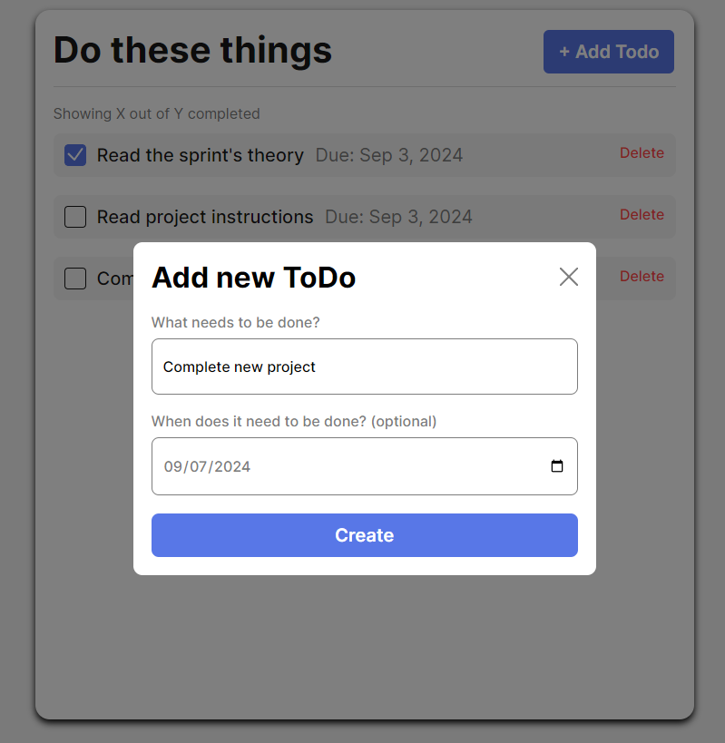

# The Simple ToDo App

To-do is a concept app that allow users to set up tasks to complete with their corresponding due dates.

## Functionality

- Users can fill the Add Todo form with the name of the task and the due date

- Todos can be checked or deleted by pressing the buttons.

## Technology

This is an OOP project. Modular JavaScript and javascript classes were used to handle the Add todo feature and form Validation.

## Deployment

This webpage is deployed to GitHub Pages

- https://dbelfla10.github.io/se_project_todo-app/
