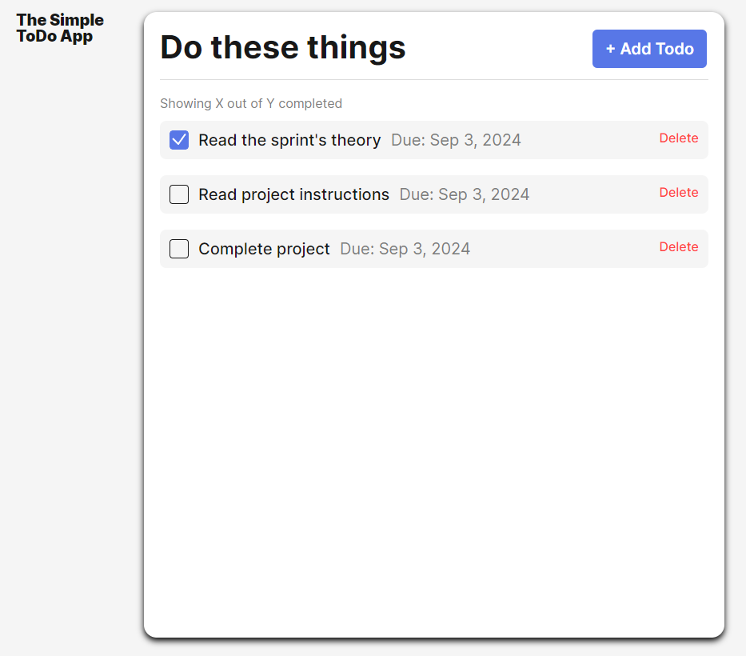

# The Simple ToDo App

To-do is a concept app that allow users to set up tasks to complete with their corresponding due dates.

## Functionality

Give a more detailed explanation of the project and its functionality.

## Technology

Give a description of the technologies and techniques used. Pictures, GIFs, or screenshots that detail the project features are recommended.

## Deployment

This webpage is deployed to GitHub Pages

- https://dbelfla10.github.io/se_project_todo-app/
